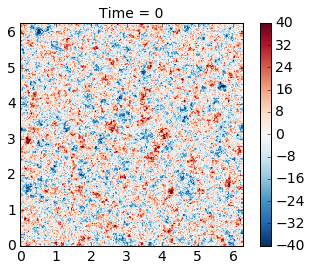

Barotropic Model
================

Here will will use pyqg to reproduce the results of the paper: J. C.
Mcwilliams (1984). The emergence of isolated coherent vortices in
turbulent flow. Journal of Fluid Mechanics, 146, pp 21-43
`doi:10.1017/S0022112084001750 <http://dx.doi.org/10.1017/S0022112084001750>`__

.. code:: python

    import numpy as np
    import matplotlib.pyplot as plt
    %matplotlib inline
    import pyqg

McWilliams performed freely-evolving 2D turbulence
(:math:`R_d = \infty`, :math:`\beta =0`) experiments on a
:math:`2\pi\times 2\pi` periodic box.

.. code:: python

    # create the model object
    m = pyqg.BTModel(L=2.*np.pi, nx=256, 
                     beta=0., H=1., rek=0., rd=None,
                     tmax=40, dt=0.001, taveint=1,
                     ntd=4)
    # in this example we used ntd=4, four threads
    # if your machine has more (or fewer) cores available, you could try changing it

.. parsed-literal::

    INFO:  Logger initialized
    INFO:  Kernel initialized

Initial condition
-----------------

The initial condition is random, with a prescribed spectrum

.. math::

   |\hat{\psi}|^2 = A \,\kappa^{-1}\left[1 + \left(\frac{\kappa}{6}\right)^4\right]^{-1}\,,

 where :math:`\kappa` is the wavenumber magnitude. The constant A is
determined so that the initial energy is :math:`KE = 0.5`.

.. code:: python

    # generate McWilliams 84 IC condition
    
    fk = m.wv != 0
    ckappa = np.zeros_like(m.wv2)
    ckappa[fk] = np.sqrt( m.wv2[fk]*(1. + (m.wv2[fk]/36.)**2) )**-1
    
    nhx,nhy = m.wv2.shape
    
    Pi_hat = np.random.randn(nhx,nhy)*ckappa +1j*np.random.randn(nhx,nhy)*ckappa
    
    Pi = m.ifft( Pi_hat[np.newaxis,:,:] )
    Pi = Pi - Pi.mean()
    Pi_hat = m.fft( Pi )
    KEaux = m.spec_var( m.wv*Pi_hat )
    
    pih = ( Pi_hat/np.sqrt(KEaux) )
    qih = -m.wv2*pih
    qi = m.ifft(qih)

.. code:: python

    # initialize the model with that initial condition
    m.set_q(qi)

.. code:: python

    # define a quick function for plotting and visualize the initial condition
    def plot_q(m, qmax=40):
        fig, ax = plt.subplots()
        pc = ax.pcolormesh(m.x,m.y,m.q.squeeze(), cmap='RdBu_r')
        pc.set_clim([-qmax, qmax])
        ax.set_xlim([0, 2*np.pi])
        ax.set_ylim([0, 2*np.pi]);
        ax.set_aspect(1)
        plt.colorbar(pc)
        plt.title('Time = %g' % m.t)
        plt.show()
    
    plot_q(m)

Runing the model
----------------

Here we demonstrate how to use the ``run_with_snapshots`` feature to
periodically stop the model and perform some action (in this case,
visualization).

.. code:: python

    for _ in m.run_with_snapshots(tsnapstart=0, tsnapint=10):
        plot_q(m)

.. parsed-literal::

    INFO: Step: 1000, Time: 1.00e+00, KE: 4.96e-01, CFL: 0.111
    INFO: Step: 2000, Time: 2.00e+00, KE: 4.95e-01, CFL: 0.108
    INFO: Step: 3000, Time: 3.00e+00, KE: 4.94e-01, CFL: 0.118
    INFO: Step: 4000, Time: 4.00e+00, KE: 4.93e-01, CFL: 0.129
    INFO: Step: 5000, Time: 5.00e+00, KE: 4.93e-01, CFL: 0.117
    INFO: Step: 6000, Time: 6.00e+00, KE: 4.93e-01, CFL: 0.111
    INFO: Step: 7000, Time: 7.00e+00, KE: 4.92e-01, CFL: 0.094
    INFO: Step: 8000, Time: 8.00e+00, KE: 4.92e-01, CFL: 0.098
    INFO: Step: 9000, Time: 9.00e+00, KE: 4.92e-01, CFL: 0.106
    INFO: Step: 10000, Time: 1.00e+01, KE: 4.92e-01, CFL: 0.122

.. parsed-literal::

    INFO: Step: 11000, Time: 1.10e+01, KE: 4.92e-01, CFL: 0.121
    INFO: Step: 12000, Time: 1.20e+01, KE: 4.92e-01, CFL: 0.129
    INFO: Step: 13000, Time: 1.30e+01, KE: 4.92e-01, CFL: 0.099
    INFO: Step: 14000, Time: 1.40e+01, KE: 4.92e-01, CFL: 0.111
    INFO: Step: 15000, Time: 1.50e+01, KE: 4.92e-01, CFL: 0.112
    INFO: Step: 16000, Time: 1.60e+01, KE: 4.92e-01, CFL: 0.100
    INFO: Step: 17000, Time: 1.70e+01, KE: 4.92e-01, CFL: 0.104
    INFO: Step: 18000, Time: 1.80e+01, KE: 4.92e-01, CFL: 0.104
    INFO: Step: 19000, Time: 1.90e+01, KE: 4.92e-01, CFL: 0.108
    INFO: Step: 20000, Time: 2.00e+01, KE: 4.92e-01, CFL: 0.126

.. parsed-literal::

    INFO: Step: 21000, Time: 2.10e+01, KE: 4.92e-01, CFL: 0.141
    INFO: Step: 22000, Time: 2.20e+01, KE: 4.92e-01, CFL: 0.136
    INFO: Step: 23000, Time: 2.30e+01, KE: 4.92e-01, CFL: 0.142
    INFO: Step: 24000, Time: 2.40e+01, KE: 4.92e-01, CFL: 0.125
    INFO: Step: 25000, Time: 2.50e+01, KE: 4.92e-01, CFL: 0.126
    INFO: Step: 26000, Time: 2.60e+01, KE: 4.92e-01, CFL: 0.122
    INFO: Step: 27000, Time: 2.70e+01, KE: 4.92e-01, CFL: 0.106
    INFO: Step: 28000, Time: 2.80e+01, KE: 4.92e-01, CFL: 0.112
    INFO: Step: 29000, Time: 2.90e+01, KE: 4.92e-01, CFL: 0.120
    INFO: Step: 30000, Time: 3.00e+01, KE: 4.92e-01, CFL: 0.110

.. parsed-literal::

    INFO: Step: 31000, Time: 3.10e+01, KE: 4.92e-01, CFL: 0.111
    INFO: Step: 32000, Time: 3.20e+01, KE: 4.92e-01, CFL: 0.110
    INFO: Step: 33000, Time: 3.30e+01, KE: 4.92e-01, CFL: 0.107
    INFO: Step: 34000, Time: 3.40e+01, KE: 4.92e-01, CFL: 0.115
    INFO: Step: 35000, Time: 3.50e+01, KE: 4.92e-01, CFL: 0.117
    INFO: Step: 36000, Time: 3.60e+01, KE: 4.92e-01, CFL: 0.111
    INFO: Step: 37000, Time: 3.70e+01, KE: 4.92e-01, CFL: 0.124
    INFO: Step: 38000, Time: 3.80e+01, KE: 4.92e-01, CFL: 0.123
    INFO: Step: 39000, Time: 3.90e+01, KE: 4.92e-01, CFL: 0.121
    INFO: Step: 40000, Time: 4.00e+01, KE: 4.92e-01, CFL: 0.126

The genius of McWilliams (1984) was that he showed that the initial
random vorticity field organizes itself into strong coherent vortices.
This is true in significant part of the parameter space. This was
previously suspected but unproven, mainly because people did not have
computer resources to run the simulation long enough. Thirty years later
we can perform such simulations in a couple of minutes on a laptop!

Also, note that the energy is nearly conserved, as it should be, and
this is a nice test of the model.

Plotting spectra
----------------

.. code:: python

    energy = m.get_diagnostic('KEspec')
    enstrophy = m.get_diagnostic('Ensspec')

.. code:: python

    # this makes it easy to calculate an isotropic spectrum
    from pyqg import diagnostic_tools as tools
    kr, energy_iso = tools.calc_ispec(m,energy.squeeze())
    _, enstrophy_iso = tools.calc_ispec(m,enstrophy.squeeze())

.. code:: python

    ks = np.array([3.,80])
    es = 5*ks**-4
    plt.loglog(kr,energy_iso)
    plt.loglog(ks,es,'k--')
    plt.text(2.5,.0001,r'$k^{-4}$',fontsize=20)
    plt.ylim(1.e-10,1.e0)
    plt.xlabel('wavenumber')
    plt.title('Energy Spectrum')

.. parsed-literal::

    <matplotlib.text.Text at 0x1166cde48>

.. code:: python

    ks = np.array([3.,80])
    es = 5*ks**(-5./3)
    plt.loglog(kr,enstrophy_iso)
    plt.loglog(ks,es,'k--')
    plt.text(5.5,.01,r'$k^{-5/3}$',fontsize=20)
    plt.ylim(1.e-3,1.e0)
    plt.xlabel('wavenumber')
    plt.title('Enstrophy Spectrum')

.. parsed-literal::

    <matplotlib.text.Text at 0x116685d30>

Adding topography
=================

pyqg supports bottom topography, which can be easily set by the user.
Here we extend the example above to include a Guassian topographic bump.

.. code:: python

    mtopo = pyqg.BTModel(L=2.*np.pi, nx=256, 
                     beta=0., H=1., rek=0., rd=None,
                     tmax=40, dt=0.001, taveint=1, f=1.,
                     ntd=4)

.. parsed-literal::

    INFO:  Logger initialized
    INFO:  Kernel initialized

.. code:: python

    mtopo.set_q(qi)

.. code:: python

    # set topography
    R2 = 1.
    etab = 10*np.exp( -(m.x-np.pi)**2/R2  -(m.y-np.pi)**2/R2  )
    etab = etab - etab.mean()
    mtopo.set_h(etab)

.. code:: python

    # define a quick function
    def plot_q(mtopo, qmax=20):
        fig, ax = plt.subplots()
        pc = ax.pcolormesh(mtopo.x,mtopo.y,mtopo.q.squeeze(), cmap='RdBu_r')
        pc.set_clim([-qmax,qmax])
        ax.set_xlim([0, 2*np.pi])
        ax.set_ylim([0, 2*np.pi]);
        ax.set_aspect(1)
        plt.colorbar(pc)
        plt.title('Time = %g' % mtopo.t)
        plt.show()
    
    plot_q(mtopo)

.. image:: barotropic_files/barotropic_20_0.png

.. code:: python

    for _ in mtopo.run_with_snapshots(tsnapstart=0, tsnapint=10):
        plot_q(mtopo)

.. parsed-literal::

    INFO: Step: 1000, Time: 1.00e+00, KE: 4.96e-01, CFL: 0.109
    INFO: Step: 2000, Time: 2.00e+00, KE: 4.95e-01, CFL: 0.096
    INFO: Step: 3000, Time: 3.00e+00, KE: 4.94e-01, CFL: 0.117
    INFO: Step: 4000, Time: 4.00e+00, KE: 4.93e-01, CFL: 0.095
    INFO: Step: 5000, Time: 5.00e+00, KE: 4.93e-01, CFL: 0.091
    INFO: Step: 6000, Time: 6.00e+00, KE: 4.93e-01, CFL: 0.094
    INFO: Step: 7000, Time: 7.00e+00, KE: 4.92e-01, CFL: 0.098
    INFO: Step: 8000, Time: 8.00e+00, KE: 4.92e-01, CFL: 0.091
    INFO: Step: 9000, Time: 9.00e+00, KE: 4.92e-01, CFL: 0.121
    INFO: Step: 10000, Time: 1.00e+01, KE: 4.92e-01, CFL: 0.113

.. image:: barotropic_files/barotropic_21_1.png

.. parsed-literal::

    INFO: Step: 11000, Time: 1.10e+01, KE: 4.92e-01, CFL: 0.110
    INFO: Step: 12000, Time: 1.20e+01, KE: 4.92e-01, CFL: 0.108
    INFO: Step: 13000, Time: 1.30e+01, KE: 4.92e-01, CFL: 0.120
    INFO: Step: 14000, Time: 1.40e+01, KE: 4.92e-01, CFL: 0.105
    INFO: Step: 15000, Time: 1.50e+01, KE: 4.92e-01, CFL: 0.119
    INFO: Step: 16000, Time: 1.60e+01, KE: 4.92e-01, CFL: 0.133
    INFO: Step: 17000, Time: 1.70e+01, KE: 4.92e-01, CFL: 0.124
    INFO: Step: 18000, Time: 1.80e+01, KE: 4.92e-01, CFL: 0.097
    INFO: Step: 19000, Time: 1.90e+01, KE: 4.92e-01, CFL: 0.103
    INFO: Step: 20000, Time: 2.00e+01, KE: 4.92e-01, CFL: 0.114

.. image:: barotropic_files/barotropic_21_3.png

.. parsed-literal::

    INFO: Step: 21000, Time: 2.10e+01, KE: 4.92e-01, CFL: 0.116
    INFO: Step: 22000, Time: 2.20e+01, KE: 4.92e-01, CFL: 0.126
    INFO: Step: 23000, Time: 2.30e+01, KE: 4.92e-01, CFL: 0.108
    INFO: Step: 24000, Time: 2.40e+01, KE: 4.92e-01, CFL: 0.128
    INFO: Step: 25000, Time: 2.50e+01, KE: 4.92e-01, CFL: 0.137
    INFO: Step: 26000, Time: 2.60e+01, KE: 4.91e-01, CFL: 0.136
    INFO: Step: 27000, Time: 2.70e+01, KE: 4.91e-01, CFL: 0.126
    INFO: Step: 28000, Time: 2.80e+01, KE: 4.91e-01, CFL: 0.128
    INFO: Step: 29000, Time: 2.90e+01, KE: 4.91e-01, CFL: 0.129
    INFO: Step: 30000, Time: 3.00e+01, KE: 4.91e-01, CFL: 0.136

.. image:: barotropic_files/barotropic_21_5.png

.. parsed-literal::

    INFO: Step: 31000, Time: 3.10e+01, KE: 4.91e-01, CFL: 0.136
    INFO: Step: 32000, Time: 3.20e+01, KE: 4.91e-01, CFL: 0.136
    INFO: Step: 33000, Time: 3.30e+01, KE: 4.91e-01, CFL: 0.131
    INFO: Step: 34000, Time: 3.40e+01, KE: 4.91e-01, CFL: 0.126
    INFO: Step: 35000, Time: 3.50e+01, KE: 4.91e-01, CFL: 0.126
    INFO: Step: 36000, Time: 3.60e+01, KE: 4.91e-01, CFL: 0.108
    INFO: Step: 37000, Time: 3.70e+01, KE: 4.91e-01, CFL: 0.133
    INFO: Step: 38000, Time: 3.80e+01, KE: 4.91e-01, CFL: 0.131
    INFO: Step: 39000, Time: 3.90e+01, KE: 4.91e-01, CFL: 0.112
    INFO: Step: 40000, Time: 4.00e+01, KE: 4.91e-01, CFL: 0.143

.. image:: barotropic_files/barotropic_21_7.png

.. code:: python

    fig = plt.figure(figsize=(13,5))
    plt.subplot(121)
    pc = plt.contourf(mtopo.x,mtopo.y,np.fft.irfft2(mtopo.ph[0]),np.linspace(-4,4,10),cmap='RdBu_r')
    plt.contour(mtopo.x,mtopo.y,etab,colors='k')
    ax.set_xlim([0, 2*np.pi])
    ax.set_ylim([0, 2*np.pi]);
    #pc.set_clim([-40,40])
    plt.colorbar(pc)
    ax.set_aspect(1)
    plt.title('Streamfunction')
    
    plt.subplot(122)
    pc = plt.contourf(mtopo.x,mtopo.y,mtopo.q[0],np.linspace(-20,20,10),cmap='RdBu_r')
    plt.contour(mtopo.x,mtopo.y,etab,colors='k')
    ax.set_xlim([0, 2*np.pi])
    ax.set_ylim([0, 2*np.pi]);
    #pc.set_clim([-40,40])
    plt.colorbar(pc)
    ax.set_aspect(1)
    plt.title('PV')

.. parsed-literal::

    <matplotlib.text.Text at 0x118631630>

.. image:: barotropic_files/barotropic_22_1.png

