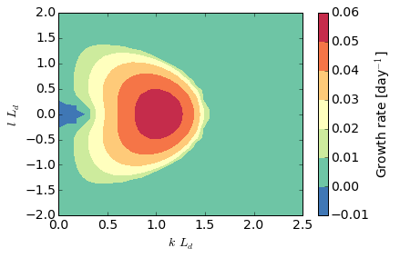
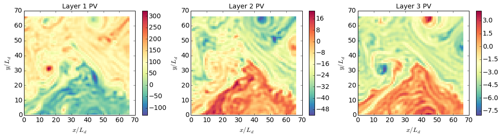
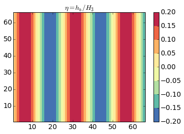
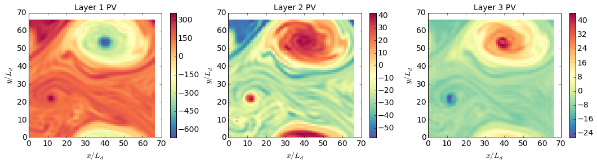
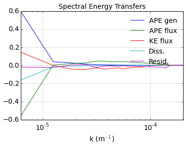

Baroclinic instability of 3-layer flow
======================================

.. code:: python

    import numpy as np
    from numpy import pi
    from matplotlib import pyplot as plt
    %matplotlib inline
    
    import pyqg

.. parsed-literal::

    Vendor:  Continuum Analytics, Inc.
    Package: mkl
    Message: trial mode expires in 23 days
    Vendor:  Continuum Analytics, Inc.
    Package: mkl
    Message: trial mode expires in 23 days
    Vendor:  Continuum Analytics, Inc.
    Package: mkl
    Message: trial mode expires in 23 days

Set up
======

.. code:: python

    L =  1000.e3     # length scale of box    [m]
    Ld = 15.e3       # deformation scale      [m]
    kd = 1./Ld       # deformation wavenumber [m^-1]
    Nx = 64          # number of grid points
    
    H1 = 500.        # layer 1 thickness  [m]
    H2 = 1750.       # layer 2 
    H3 = 1750.       # layer 3 
    
    U1 = 0.05          # layer 1 zonal velocity [m/s]
    U2 = 0.01         # layer 2
    U3 = 0.00         # layer 3
    
    rho1 = 1025.
    rho2 = 1025.275
    rho3 = 1025.640
    
    rek = 1.e-7       # linear bottom drag coeff.  [s^-1]
    f0  = 0.0001236812857687059 # coriolis param [s^-1]
    beta = 1.2130692965249345e-11 # planetary vorticity gradient [m^-1 s^-1]
    
    Ti = Ld/(abs(U1))  # estimate of most unstable e-folding time scale [s]
    dt = Ti/500.   # time-step [s]
    tmax = 300*Ti      # simulation time [s]

.. code:: python

    m = pyqg.LayeredModel(nx=Nx, nz=3, U = np.array([U1,U2,U3]),V=np.array([0.,0.,0.]),L=L,f=f0,beta=beta,
                                  rd=Ld, H = np.array([H1,H2,H3]), rho=np.array([rho1,rho2,rho3]),rek=rek,
                                  dt=dt,tmax=tmax, twrite=5000, tavestart=Ti*300)

.. parsed-literal::

    2015-10-18 21:01:25,054 - pyqg.model - INFO -  Logger initialized
    INFO:pyqg.model: Logger initialized
    2015-10-18 21:01:25,115 - pyqg.model - INFO -  Kernel initialized
    INFO:pyqg.model: Kernel initialized

Linear stability analysis
=========================

.. code:: python

    m.stability_analysis(bottom_friction=True)

.. code:: python

    plt.contourf(m.k*Ld,np.fft.fftshift(m.l)*Ld,np.fft.fftshift(m.omg.imag,axes=(0,))*86400)
    plt.xlim(0,2.5)
    plt.ylim(-2.,2.)
    plt.xlabel(r'$k\,L_d$')
    plt.ylabel(r'$l\, L_d$')
    plt.colorbar(label=r"Growth rate [day$^{-1}$]")

.. parsed-literal::

    <matplotlib.colorbar.Colorbar instance at 0x1128d9248>

Vertical modes
==============

.. code:: python

    m.vertical_modes()

.. code:: python

    print "The barotropic deformation radius is",m.radii[0]/1.e3," km"
    print "The 1st baroclinic deformation radius is",m.radii[1]/1.e3," km"
    print "The 2nd baroclinic deformation radius is",m.radii[2]/1.e3," km"

.. parsed-literal::

    The barotropic deformation radius is 317267.076875  km
    The 1st baroclinic deformation radius is 15.375382786  km
    The 2nd baroclinic deformation radius is 7.975516272  km

.. code:: python

    print "The eigenstructure of the 1st baroclinic mode is", m.pmodes[1]

.. parsed-literal::

    The eigenstructure of the 1st baroclinic mode is [ 0.57735027  0.42365409 -0.3317543 ]

Initial condition
=================

.. code:: python

    sig = 1.e-7
    qi = sig*np.vstack([np.random.randn(m.nx,m.ny)[np.newaxis,],np.random.randn(m.nx,m.ny)[np.newaxis,],
                        np.random.randn(m.nx,m.ny)[np.newaxis,]])
    m.set_q(qi)

.. code:: python

    m.run()

.. parsed-literal::

    2015-10-18 21:01:32,531 - pyqg.model - INFO -  Step: 5000, Time: 3.000000e+06, KE: 7.755665e-07, CFL: 0.002097
    INFO:pyqg.model: Step: 5000, Time: 3.000000e+06, KE: 7.755665e-07, CFL: 0.002097
    2015-10-18 21:01:39,523 - pyqg.model - INFO -  Step: 10000, Time: 6.000000e+06, KE: 1.131815e-05, CFL: 0.002568
    INFO:pyqg.model: Step: 10000, Time: 6.000000e+06, KE: 1.131815e-05, CFL: 0.002568
    2015-10-18 21:01:46,560 - pyqg.model - INFO -  Step: 15000, Time: 9.000000e+06, KE: 2.987078e-04, CFL: 0.006453
    INFO:pyqg.model: Step: 15000, Time: 9.000000e+06, KE: 2.987078e-04, CFL: 0.006453
    2015-10-18 21:01:53,418 - pyqg.model - INFO -  Step: 20000, Time: 1.200000e+07, KE: 2.612786e-03, CFL: 0.017886
    INFO:pyqg.model: Step: 20000, Time: 1.200000e+07, KE: 2.612786e-03, CFL: 0.017886
    2015-10-18 21:02:00,418 - pyqg.model - INFO -  Step: 25000, Time: 1.500000e+07, KE: 6.359552e-03, CFL: 0.024197
    INFO:pyqg.model: Step: 25000, Time: 1.500000e+07, KE: 6.359552e-03, CFL: 0.024197
    2015-10-18 21:02:07,364 - pyqg.model - INFO -  Step: 30000, Time: 1.800000e+07, KE: 1.356034e-02, CFL: 0.032248
    INFO:pyqg.model: Step: 30000, Time: 1.800000e+07, KE: 1.356034e-02, CFL: 0.032248
    2015-10-18 21:02:14,308 - pyqg.model - INFO -  Step: 35000, Time: 2.100000e+07, KE: 2.722034e-02, CFL: 0.041188
    INFO:pyqg.model: Step: 35000, Time: 2.100000e+07, KE: 2.722034e-02, CFL: 0.041188
    2015-10-18 21:02:21,152 - pyqg.model - INFO -  Step: 40000, Time: 2.400000e+07, KE: 5.121692e-02, CFL: 0.062444
    INFO:pyqg.model: Step: 40000, Time: 2.400000e+07, KE: 5.121692e-02, CFL: 0.062444
    2015-10-18 21:02:27,993 - pyqg.model - INFO -  Step: 45000, Time: 2.700000e+07, KE: 1.037967e-01, CFL: 0.075710
    INFO:pyqg.model: Step: 45000, Time: 2.700000e+07, KE: 1.037967e-01, CFL: 0.075710
    2015-10-18 21:02:34,744 - pyqg.model - INFO -  Step: 50000, Time: 3.000000e+07, KE: 1.621912e-01, CFL: 0.101743
    INFO:pyqg.model: Step: 50000, Time: 3.000000e+07, KE: 1.621912e-01, CFL: 0.101743
    2015-10-18 21:02:41,487 - pyqg.model - INFO -  Step: 55000, Time: 3.300000e+07, KE: 2.219798e-01, CFL: 0.084253
    INFO:pyqg.model: Step: 55000, Time: 3.300000e+07, KE: 2.219798e-01, CFL: 0.084253
    2015-10-18 21:02:48,304 - pyqg.model - INFO -  Step: 60000, Time: 3.600000e+07, KE: 2.769354e-01, CFL: 0.111373
    INFO:pyqg.model: Step: 60000, Time: 3.600000e+07, KE: 2.769354e-01, CFL: 0.111373
    2015-10-18 21:02:55,064 - pyqg.model - INFO -  Step: 65000, Time: 3.900000e+07, KE: 4.475193e-01, CFL: 0.143377
    INFO:pyqg.model: Step: 65000, Time: 3.900000e+07, KE: 4.475193e-01, CFL: 0.143377
    2015-10-18 21:03:01,994 - pyqg.model - INFO -  Step: 70000, Time: 4.200000e+07, KE: 6.310229e-01, CFL: 0.140614
    INFO:pyqg.model: Step: 70000, Time: 4.200000e+07, KE: 6.310229e-01, CFL: 0.140614
    2015-10-18 21:03:08,952 - pyqg.model - INFO -  Step: 75000, Time: 4.500000e+07, KE: 9.066976e-01, CFL: 0.159290
    INFO:pyqg.model: Step: 75000, Time: 4.500000e+07, KE: 9.066976e-01, CFL: 0.159290
    2015-10-18 21:03:15,951 - pyqg.model - INFO -  Step: 80000, Time: 4.800000e+07, KE: 9.186941e-01, CFL: 0.121972
    INFO:pyqg.model: Step: 80000, Time: 4.800000e+07, KE: 9.186941e-01, CFL: 0.121972
    2015-10-18 21:03:22,952 - pyqg.model - INFO -  Step: 85000, Time: 5.100000e+07, KE: 8.160156e-01, CFL: 0.123160
    INFO:pyqg.model: Step: 85000, Time: 5.100000e+07, KE: 8.160156e-01, CFL: 0.123160
    2015-10-18 21:03:29,970 - pyqg.model - INFO -  Step: 90000, Time: 5.400000e+07, KE: 7.597135e-01, CFL: 0.113836
    INFO:pyqg.model: Step: 90000, Time: 5.400000e+07, KE: 7.597135e-01, CFL: 0.113836
    2015-10-18 21:03:36,963 - pyqg.model - INFO -  Step: 95000, Time: 5.700000e+07, KE: 7.954136e-01, CFL: 0.142363
    INFO:pyqg.model: Step: 95000, Time: 5.700000e+07, KE: 7.954136e-01, CFL: 0.142363
    2015-10-18 21:03:43,683 - pyqg.model - INFO -  Step: 100000, Time: 6.000000e+07, KE: 1.145862e+00, CFL: 0.172602
    INFO:pyqg.model: Step: 100000, Time: 6.000000e+07, KE: 1.145862e+00, CFL: 0.172602
    2015-10-18 21:03:50,611 - pyqg.model - INFO -  Step: 105000, Time: 6.300000e+07, KE: 1.097439e+00, CFL: 0.117151
    INFO:pyqg.model: Step: 105000, Time: 6.300000e+07, KE: 1.097439e+00, CFL: 0.117151
    2015-10-18 21:03:57,561 - pyqg.model - INFO -  Step: 110000, Time: 6.600000e+07, KE: 9.893695e-01, CFL: 0.103434
    INFO:pyqg.model: Step: 110000, Time: 6.600000e+07, KE: 9.893695e-01, CFL: 0.103434
    2015-10-18 21:04:04,541 - pyqg.model - INFO -  Step: 115000, Time: 6.900000e+07, KE: 8.615331e-01, CFL: 0.110398
    INFO:pyqg.model: Step: 115000, Time: 6.900000e+07, KE: 8.615331e-01, CFL: 0.110398
    2015-10-18 21:04:11,484 - pyqg.model - INFO -  Step: 120000, Time: 7.200000e+07, KE: 7.669313e-01, CFL: 0.110481
    INFO:pyqg.model: Step: 120000, Time: 7.200000e+07, KE: 7.669313e-01, CFL: 0.110481
    2015-10-18 21:04:18,547 - pyqg.model - INFO -  Step: 125000, Time: 7.500000e+07, KE: 7.046487e-01, CFL: 0.121378
    INFO:pyqg.model: Step: 125000, Time: 7.500000e+07, KE: 7.046487e-01, CFL: 0.121378
    2015-10-18 21:04:25,362 - pyqg.model - INFO -  Step: 130000, Time: 7.800000e+07, KE: 6.383032e-01, CFL: 0.113402
    INFO:pyqg.model: Step: 130000, Time: 7.800000e+07, KE: 6.383032e-01, CFL: 0.113402
    2015-10-18 21:04:31,984 - pyqg.model - INFO -  Step: 135000, Time: 8.100000e+07, KE: 5.867211e-01, CFL: 0.105678
    INFO:pyqg.model: Step: 135000, Time: 8.100000e+07, KE: 5.867211e-01, CFL: 0.105678
    2015-10-18 21:04:38,885 - pyqg.model - INFO -  Step: 140000, Time: 8.400000e+07, KE: 5.287634e-01, CFL: 0.122640
    INFO:pyqg.model: Step: 140000, Time: 8.400000e+07, KE: 5.287634e-01, CFL: 0.122640
    2015-10-18 21:04:45,939 - pyqg.model - INFO -  Step: 145000, Time: 8.700000e+07, KE: 7.139401e-01, CFL: 0.144960
    INFO:pyqg.model: Step: 145000, Time: 8.700000e+07, KE: 7.139401e-01, CFL: 0.144960

.. code:: python

    plt.figure(figsize=(18,4))
    
    plt.subplot(131)
    plt.pcolormesh(m.x/m.rd,m.y/m.rd,(m.q[0,]+m.Qy[0]*m.y)/(U1/Ld),cmap='Spectral_r')
    plt.xlabel(r'$x/L_d$')
    plt.ylabel(r'$y/L_d$')
    plt.colorbar()
    plt.title('Layer 1 PV')
    
    plt.subplot(132)
    plt.pcolormesh(m.x/m.rd,m.y/m.rd,(m.q[1,]+m.Qy[1]*m.y)/(U1/Ld),cmap='Spectral_r')
    plt.xlabel(r'$x/L_d$')
    plt.ylabel(r'$y/L_d$')
    plt.colorbar()
    plt.title('Layer 2 PV')
    
    plt.subplot(133)
    plt.pcolormesh(m.x/m.rd,m.y/m.rd,(m.q[2,]+m.Qy[2]*m.y+m.hb)/(U1/Ld),cmap='Spectral_r')
    plt.xlabel(r'$x/L_d$')
    plt.ylabel(r'$y/L_d$')
    plt.colorbar()
    plt.title('Layer 3 PV')

.. parsed-literal::

    <matplotlib.text.Text at 0x1132ba690>

Now repeat the simulation with topography
=========================================

.. code:: python

    b = 10*Ld        # deccay scale of topographic feature [m]
    A = .2           # amplitude of topographic feature h/H2 [unitless]
    
    eta = A*np.sin(0.25*m.x/m.rd)
    
    plt.contourf(m.x/Ld,m.y/Ld,eta)
    plt.colorbar()
    plt.title(r"$\eta = h_b/H_3$")

.. parsed-literal::

    <matplotlib.text.Text at 0x112e37410>

.. code:: python

    mtopo = pyqg.LayeredModel(nx=Nx, nz=3, U = np.array([U1,U2,U3]),V=np.array([0.,0.,0.]),L=L,f=f0,beta=beta,
                                  rd=Ld, H = np.array([H1,H2,H3]), rho=np.array([rho1,rho2,rho3]),rek=rek,
                                  dt=dt,tmax=tmax, twrite=5000, tavestart=Ti*300, hb=H3*eta)

.. parsed-literal::

    2015-10-18 21:04:53,893 - pyqg.model - INFO -  Logger initialized
    2015-10-18 21:04:53,893 - pyqg.model - INFO -  Logger initialized
    INFO:pyqg.model: Logger initialized
    2015-10-18 21:04:53,895 - pyqg.model - INFO -  Kernel initialized
    2015-10-18 21:04:53,895 - pyqg.model - INFO -  Kernel initialized
    INFO:pyqg.model: Kernel initialized

.. code:: python

    mtopo.set_q(qi)

.. code:: python

    mtopo.run()

.. parsed-literal::

    2015-10-18 21:05:01,035 - pyqg.model - INFO -  Step: 5000, Time: 3.000000e+06, KE: 6.333061e-07, CFL: 0.002051
    2015-10-18 21:05:01,035 - pyqg.model - INFO -  Step: 5000, Time: 3.000000e+06, KE: 6.333061e-07, CFL: 0.002051
    INFO:pyqg.model: Step: 5000, Time: 3.000000e+06, KE: 6.333061e-07, CFL: 0.002051
    2015-10-18 21:05:07,956 - pyqg.model - INFO -  Step: 10000, Time: 6.000000e+06, KE: 8.959739e-06, CFL: 0.002379
    2015-10-18 21:05:07,956 - pyqg.model - INFO -  Step: 10000, Time: 6.000000e+06, KE: 8.959739e-06, CFL: 0.002379
    INFO:pyqg.model: Step: 10000, Time: 6.000000e+06, KE: 8.959739e-06, CFL: 0.002379
    2015-10-18 21:05:14,719 - pyqg.model - INFO -  Step: 15000, Time: 9.000000e+06, KE: 2.443646e-04, CFL: 0.006001
    2015-10-18 21:05:14,719 - pyqg.model - INFO -  Step: 15000, Time: 9.000000e+06, KE: 2.443646e-04, CFL: 0.006001
    INFO:pyqg.model: Step: 15000, Time: 9.000000e+06, KE: 2.443646e-04, CFL: 0.006001
    2015-10-18 21:05:21,703 - pyqg.model - INFO -  Step: 20000, Time: 1.200000e+07, KE: 2.578728e-03, CFL: 0.016160
    2015-10-18 21:05:21,703 - pyqg.model - INFO -  Step: 20000, Time: 1.200000e+07, KE: 2.578728e-03, CFL: 0.016160
    INFO:pyqg.model: Step: 20000, Time: 1.200000e+07, KE: 2.578728e-03, CFL: 0.016160
    2015-10-18 21:05:28,590 - pyqg.model - INFO -  Step: 25000, Time: 1.500000e+07, KE: 5.029671e-03, CFL: 0.022959
    2015-10-18 21:05:28,590 - pyqg.model - INFO -  Step: 25000, Time: 1.500000e+07, KE: 5.029671e-03, CFL: 0.022959
    INFO:pyqg.model: Step: 25000, Time: 1.500000e+07, KE: 5.029671e-03, CFL: 0.022959
    2015-10-18 21:05:35,543 - pyqg.model - INFO -  Step: 30000, Time: 1.800000e+07, KE: 9.441224e-03, CFL: 0.029245
    2015-10-18 21:05:35,543 - pyqg.model - INFO -  Step: 30000, Time: 1.800000e+07, KE: 9.441224e-03, CFL: 0.029245
    INFO:pyqg.model: Step: 30000, Time: 1.800000e+07, KE: 9.441224e-03, CFL: 0.029245
    2015-10-18 21:05:42,560 - pyqg.model - INFO -  Step: 35000, Time: 2.100000e+07, KE: 1.480638e-02, CFL: 0.029280
    2015-10-18 21:05:42,560 - pyqg.model - INFO -  Step: 35000, Time: 2.100000e+07, KE: 1.480638e-02, CFL: 0.029280
    INFO:pyqg.model: Step: 35000, Time: 2.100000e+07, KE: 1.480638e-02, CFL: 0.029280
    2015-10-18 21:05:49,438 - pyqg.model - INFO -  Step: 40000, Time: 2.400000e+07, KE: 2.537192e-02, CFL: 0.037501
    2015-10-18 21:05:49,438 - pyqg.model - INFO -  Step: 40000, Time: 2.400000e+07, KE: 2.537192e-02, CFL: 0.037501
    INFO:pyqg.model: Step: 40000, Time: 2.400000e+07, KE: 2.537192e-02, CFL: 0.037501
    2015-10-18 21:05:56,134 - pyqg.model - INFO -  Step: 45000, Time: 2.700000e+07, KE: 8.106170e-02, CFL: 0.071475
    2015-10-18 21:05:56,134 - pyqg.model - INFO -  Step: 45000, Time: 2.700000e+07, KE: 8.106170e-02, CFL: 0.071475
    INFO:pyqg.model: Step: 45000, Time: 2.700000e+07, KE: 8.106170e-02, CFL: 0.071475
    2015-10-18 21:06:02,945 - pyqg.model - INFO -  Step: 50000, Time: 3.000000e+07, KE: 1.732821e-01, CFL: 0.085336
    2015-10-18 21:06:02,945 - pyqg.model - INFO -  Step: 50000, Time: 3.000000e+07, KE: 1.732821e-01, CFL: 0.085336
    INFO:pyqg.model: Step: 50000, Time: 3.000000e+07, KE: 1.732821e-01, CFL: 0.085336
    2015-10-18 21:06:10,036 - pyqg.model - INFO -  Step: 55000, Time: 3.300000e+07, KE: 3.604407e-01, CFL: 0.111139
    2015-10-18 21:06:10,036 - pyqg.model - INFO -  Step: 55000, Time: 3.300000e+07, KE: 3.604407e-01, CFL: 0.111139
    INFO:pyqg.model: Step: 55000, Time: 3.300000e+07, KE: 3.604407e-01, CFL: 0.111139
    2015-10-18 21:06:16,946 - pyqg.model - INFO -  Step: 60000, Time: 3.600000e+07, KE: 4.875537e-01, CFL: 0.142567
    2015-10-18 21:06:16,946 - pyqg.model - INFO -  Step: 60000, Time: 3.600000e+07, KE: 4.875537e-01, CFL: 0.142567
    INFO:pyqg.model: Step: 60000, Time: 3.600000e+07, KE: 4.875537e-01, CFL: 0.142567
    2015-10-18 21:06:23,684 - pyqg.model - INFO -  Step: 65000, Time: 3.900000e+07, KE: 8.203526e-01, CFL: 0.221599
    2015-10-18 21:06:23,684 - pyqg.model - INFO -  Step: 65000, Time: 3.900000e+07, KE: 8.203526e-01, CFL: 0.221599
    INFO:pyqg.model: Step: 65000, Time: 3.900000e+07, KE: 8.203526e-01, CFL: 0.221599
    2015-10-18 21:06:30,489 - pyqg.model - INFO -  Step: 70000, Time: 4.200000e+07, KE: 1.161494e+00, CFL: 0.168276
    2015-10-18 21:06:30,489 - pyqg.model - INFO -  Step: 70000, Time: 4.200000e+07, KE: 1.161494e+00, CFL: 0.168276
    INFO:pyqg.model: Step: 70000, Time: 4.200000e+07, KE: 1.161494e+00, CFL: 0.168276
    2015-10-18 21:06:37,308 - pyqg.model - INFO -  Step: 75000, Time: 4.500000e+07, KE: 1.794811e+00, CFL: 0.209574
    2015-10-18 21:06:37,308 - pyqg.model - INFO -  Step: 75000, Time: 4.500000e+07, KE: 1.794811e+00, CFL: 0.209574
    INFO:pyqg.model: Step: 75000, Time: 4.500000e+07, KE: 1.794811e+00, CFL: 0.209574
    2015-10-18 21:06:44,033 - pyqg.model - INFO -  Step: 80000, Time: 4.800000e+07, KE: 2.366553e+00, CFL: 0.177159
    2015-10-18 21:06:44,033 - pyqg.model - INFO -  Step: 80000, Time: 4.800000e+07, KE: 2.366553e+00, CFL: 0.177159
    INFO:pyqg.model: Step: 80000, Time: 4.800000e+07, KE: 2.366553e+00, CFL: 0.177159
    2015-10-18 21:06:50,662 - pyqg.model - INFO -  Step: 85000, Time: 5.100000e+07, KE: 2.604520e+00, CFL: 0.298507
    2015-10-18 21:06:50,662 - pyqg.model - INFO -  Step: 85000, Time: 5.100000e+07, KE: 2.604520e+00, CFL: 0.298507
    INFO:pyqg.model: Step: 85000, Time: 5.100000e+07, KE: 2.604520e+00, CFL: 0.298507
    2015-10-18 21:06:57,835 - pyqg.model - INFO -  Step: 90000, Time: 5.400000e+07, KE: 3.203843e+00, CFL: 0.262060
    2015-10-18 21:06:57,835 - pyqg.model - INFO -  Step: 90000, Time: 5.400000e+07, KE: 3.203843e+00, CFL: 0.262060
    INFO:pyqg.model: Step: 90000, Time: 5.400000e+07, KE: 3.203843e+00, CFL: 0.262060
    2015-10-18 21:07:04,778 - pyqg.model - INFO -  Step: 95000, Time: 5.700000e+07, KE: 4.373873e+00, CFL: 0.214600
    2015-10-18 21:07:04,778 - pyqg.model - INFO -  Step: 95000, Time: 5.700000e+07, KE: 4.373873e+00, CFL: 0.214600
    INFO:pyqg.model: Step: 95000, Time: 5.700000e+07, KE: 4.373873e+00, CFL: 0.214600
    2015-10-18 21:07:11,555 - pyqg.model - INFO -  Step: 100000, Time: 6.000000e+07, KE: 4.739844e+00, CFL: 0.270425
    2015-10-18 21:07:11,555 - pyqg.model - INFO -  Step: 100000, Time: 6.000000e+07, KE: 4.739844e+00, CFL: 0.270425
    INFO:pyqg.model: Step: 100000, Time: 6.000000e+07, KE: 4.739844e+00, CFL: 0.270425
    2015-10-18 21:07:18,244 - pyqg.model - INFO -  Step: 105000, Time: 6.300000e+07, KE: 4.078451e+00, CFL: 0.226364
    2015-10-18 21:07:18,244 - pyqg.model - INFO -  Step: 105000, Time: 6.300000e+07, KE: 4.078451e+00, CFL: 0.226364
    INFO:pyqg.model: Step: 105000, Time: 6.300000e+07, KE: 4.078451e+00, CFL: 0.226364
    2015-10-18 21:07:24,963 - pyqg.model - INFO -  Step: 110000, Time: 6.600000e+07, KE: 4.796321e+00, CFL: 0.308963
    2015-10-18 21:07:24,963 - pyqg.model - INFO -  Step: 110000, Time: 6.600000e+07, KE: 4.796321e+00, CFL: 0.308963
    INFO:pyqg.model: Step: 110000, Time: 6.600000e+07, KE: 4.796321e+00, CFL: 0.308963
    2015-10-18 21:07:31,709 - pyqg.model - INFO -  Step: 115000, Time: 6.900000e+07, KE: 6.897461e+00, CFL: 0.380276
    2015-10-18 21:07:31,709 - pyqg.model - INFO -  Step: 115000, Time: 6.900000e+07, KE: 6.897461e+00, CFL: 0.380276
    INFO:pyqg.model: Step: 115000, Time: 6.900000e+07, KE: 6.897461e+00, CFL: 0.380276
    2015-10-18 21:07:38,472 - pyqg.model - INFO -  Step: 120000, Time: 7.200000e+07, KE: 8.147603e+00, CFL: 0.351678
    2015-10-18 21:07:38,472 - pyqg.model - INFO -  Step: 120000, Time: 7.200000e+07, KE: 8.147603e+00, CFL: 0.351678
    INFO:pyqg.model: Step: 120000, Time: 7.200000e+07, KE: 8.147603e+00, CFL: 0.351678
    2015-10-18 21:07:45,149 - pyqg.model - INFO -  Step: 125000, Time: 7.500000e+07, KE: 1.015851e+01, CFL: 0.291437
    2015-10-18 21:07:45,149 - pyqg.model - INFO -  Step: 125000, Time: 7.500000e+07, KE: 1.015851e+01, CFL: 0.291437
    INFO:pyqg.model: Step: 125000, Time: 7.500000e+07, KE: 1.015851e+01, CFL: 0.291437
    2015-10-18 21:07:51,856 - pyqg.model - INFO -  Step: 130000, Time: 7.800000e+07, KE: 9.219923e+00, CFL: 0.344705
    2015-10-18 21:07:51,856 - pyqg.model - INFO -  Step: 130000, Time: 7.800000e+07, KE: 9.219923e+00, CFL: 0.344705
    INFO:pyqg.model: Step: 130000, Time: 7.800000e+07, KE: 9.219923e+00, CFL: 0.344705
    2015-10-18 21:07:58,526 - pyqg.model - INFO -  Step: 135000, Time: 8.100000e+07, KE: 8.914787e+00, CFL: 0.377882
    2015-10-18 21:07:58,526 - pyqg.model - INFO -  Step: 135000, Time: 8.100000e+07, KE: 8.914787e+00, CFL: 0.377882
    INFO:pyqg.model: Step: 135000, Time: 8.100000e+07, KE: 8.914787e+00, CFL: 0.377882
    2015-10-18 21:08:05,118 - pyqg.model - INFO -  Step: 140000, Time: 8.400000e+07, KE: 9.907326e+00, CFL: 0.299995
    2015-10-18 21:08:05,118 - pyqg.model - INFO -  Step: 140000, Time: 8.400000e+07, KE: 9.907326e+00, CFL: 0.299995
    INFO:pyqg.model: Step: 140000, Time: 8.400000e+07, KE: 9.907326e+00, CFL: 0.299995
    2015-10-18 21:08:11,771 - pyqg.model - INFO -  Step: 145000, Time: 8.700000e+07, KE: 8.526382e+00, CFL: 0.305294
    2015-10-18 21:08:11,771 - pyqg.model - INFO -  Step: 145000, Time: 8.700000e+07, KE: 8.526382e+00, CFL: 0.305294
    INFO:pyqg.model: Step: 145000, Time: 8.700000e+07, KE: 8.526382e+00, CFL: 0.305294

.. code:: python

    plt.figure(figsize=(18,4))
    
    plt.subplot(131)
    plt.pcolormesh(mtopo.x/mtopo.rd,mtopo.y/mtopo.rd,(mtopo.q[0,]+mtopo.Qy[0]*mtopo.y)/(U1/Ld),cmap='Spectral_r')
    plt.xlabel(r'$x/L_d$')
    plt.ylabel(r'$y/L_d$')
    plt.colorbar()
    plt.title('Layer 1 PV')
    
    plt.subplot(132)
    plt.pcolormesh(mtopo.x/mtopo.rd,m.y/mtopo.rd,(mtopo.q[1,]+mtopo.Qy[1]*mtopo.y)/(U1/Ld),cmap='Spectral_r')
    plt.xlabel(r'$x/L_d$')
    plt.ylabel(r'$y/L_d$')
    plt.colorbar()
    plt.title('Layer 2 PV')
    
    plt.subplot(133)
    plt.pcolormesh(mtopo.x/mtopo.rd,mtopo.y/mtopo.rd,(mtopo.q[2]+mtopo.Qy[2]*mtopo.y+mtopo.hb)/(U1/Ld),cmap='Spectral_r')
    plt.xlabel(r'$x/L_d$')
    plt.ylabel(r'$y/L_d$')
    plt.colorbar()
    plt.title('Layer 3 PV')

.. parsed-literal::

    <matplotlib.text.Text at 0x114306790>

Plot diagnostics
----------------

.. code:: python

    m.describe_diagnostics()

.. parsed-literal::

    NAME       | DESCRIPTION
    --------------------------------------------------------------------------------
    APEflux    | spectral divergence of flux of available potential energy
    APEgenspec | the rate of generation of available potential energy  
    APEspec    | available potential energy spectrum                   
    EKE        | mean eddy kinetic energy                              
    EKEdiss    | total energy dissipation by bottom drag               
    Ensspec    | enstrophy spectrum                                    
    KEflux     | spectral divergence of flux of kinetic energy         
    KEspec     | level-wise kinetic energy spectrum                    
    entspec    | barotropic enstrophy spectrum                         
    q          | QGPV                                                  
    u          | zonal velocity                                        
    v          | meridional velocity                                   
    vq         | meridional PV flux                                    

.. code:: python

    ebud = [ m.get_diagnostic('APEgenspec').sum(axis=0),
             m.get_diagnostic('APEflux').sum(axis=0),
             m.get_diagnostic('KEflux').sum(axis=0),
             -m.rek*(m.Hi[-1]/m.H)*m.get_diagnostic('KEspec')[1].sum(axis=0)*m.M**2 ]
    ebud.append(-np.vstack(ebud).sum(axis=0))
    ebud_labels = ['APE gen','APE flux','KE flux','Diss.','Resid.']
    [plt.semilogx(m.kk, term) for term in ebud]
    plt.legend(ebud_labels, loc='upper right')
    plt.xlim([m.kk.min(), m.kk.max()])
    plt.xlabel(r'k (m$^{-1}$)'); plt.grid()
    plt.title('Spectral Energy Transfers');

